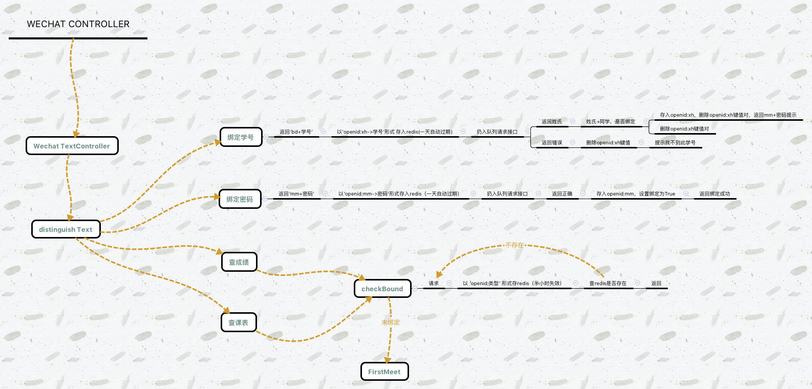

# rixinwx订阅号

## 依赖
 * laravel5.1
 * easywechat
 
## 部署
 * docker pull ecjtunet/php
 * docker run --rm -v $(pwd):/app composer/composer install
 * 运行supervisor,监听wechat-worker-supervisor.conf任务
 
## 思路
 
 
## 完成功能
* 保存用户详情
* 绑定学号
* 绑定密码

## TODO
 * 返回成绩
 * 查询15班级课表
 